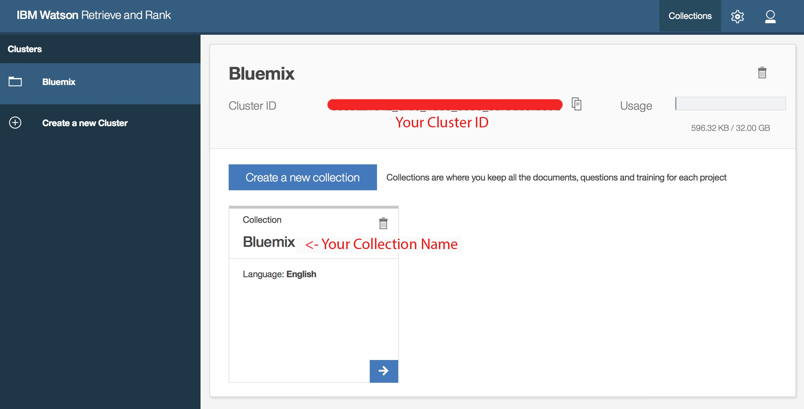

# ibm-RetrieveAndRank-agent

A simple virtual chat agent template that uses IBM <b>Retrieve and Rank service</b> API.

## Setup

>Fill the credentials in the <b>credentials.json</b> file, in order to enable retrieve and rank service

```json
{
  "retrieve_and_rank":{
  "username":"fill here",
  "password":"fill here",
  "ranker_id":"fill here"
  },
  "rrparams":{
  "cluster_id":"fill here",
  "collection_name":"fill here"
  }
}
```

>1.To get your Retrieve and Rank <b>username</b> and <b>password</b>.
>
>On your <b>dashboard</b>, click your <b>Retrieve and Rank</b> service, then click <b>Service Credentials</b> tab.
>
>
>
>2.To get your Retrieve and Rank <b>Cluster ID</b> and <b>Collection Name</b>.
>
>On your <b>Retrieve and Rank</b> service page, click your <b>Launch Tooling</b> button.
>
>
>
>3.To get your Retrieve and Rank <b>Ranker ID</b>.
>Frist click the <b>Blue Arrow</b> on your collection, then go to <b>Performence</b> tab, you should able to see your ranker id if you had done training 150 questions and generated a ranker.
>
>
>

## Installation
ibm-conversation-agent requires [Node.js](https://nodejs.org/) to run.

Install the dependencies and devDependencies and start the server.

```sh
$ cd ibm-conversation-agent
$ npm install -d
$ node server
```

## Test
Goto [localhost:3000](127.0.0.1:3000/)

